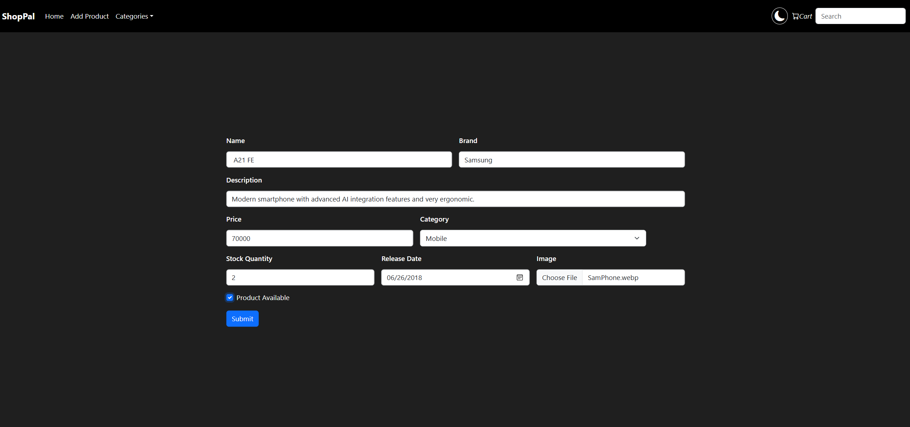
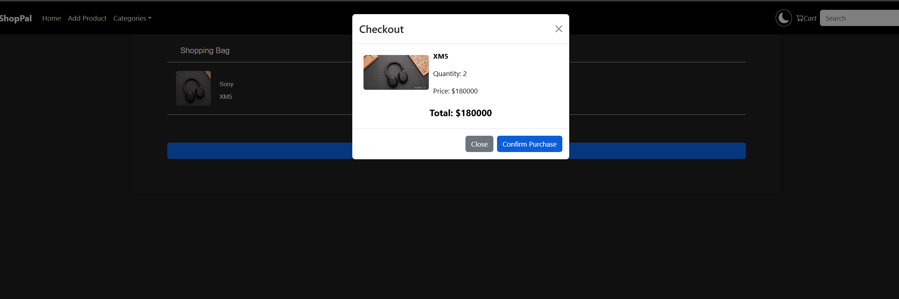

# ShopPal - Fullstack E-Commerce Application

Welcome to **ShopPal**, a fullstack e-commerce web application built using **Spring Boot** (Java) for the backend and **React** (with Vite) for the frontend.  
This project demonstrates core e-commerce features including product management, searching, image uploads, cart management, and stock control.

---

## Table of Contents

- [Features](#features)  
- [Technologies Used](#technologies-used)  
- [Project Structure](#project-structure)  
- [Getting Started](#getting-started)  
- [Usage](#usage)  
- [API Endpoints](#api-endpoints)  
- [Known Limitations](#known-limitations)  
- [Future Improvements](#future-improvements)  
- [License](#license)

---

## Features

- Add, update, delete products with image upload  
- Search products by keyword (name, description, brand, category)  
- Category filtering  
- Dynamic product listing with stock availability  
- Shopping cart with quantity controls  
- Stock decrement on adding to cart (checkout)  
- Theme toggle (light/dark mode)  
- Responsive UI using Bootstrap  
- H2 in-memory database for easy setup and demo purposes

---

## Technologies Used

| Layer        | Technology               |
|--------------|--------------------------|
| Backend      | Java, Spring Boot, Spring Data JPA, Hibernate, H2 Database |
| Frontend     | React, Vite, Axios, Bootstrap, JavaScript |
| Build Tools  | Maven (Backend), npm (Frontend) |

---

## Project Structure
root/
├── backend/ # Spring Boot backend application
│ │ ├── main/java/com/example/ecom_proj/ # Main Java source
│ │ ├── resources/ # Configurations, static files
│ ├── pom.xml # Maven config & dependencies
├── frontend/ # React frontend application
│ ├── src/
│ │ ├── components/ # React components (Navbar, Product, Cart, etc.)
│ │ ├── App.jsx # Main React app file
│ ├── package.json # npm dependencies & scripts
└── README.md # This file

---

## Getting Started

### Pre-requisites

- JDK 17 or above installed (backend requires Java 23 tested)
- Maven installed
- Node.js (v16 or newer) and npm installed

### Clone the repository
git clone AshrithRedx/Ecommerce-with-Springboot/
cd AshrithRedx/Ecommerce-with-Springboot/

---

### Run Backend (Spring Boot)

mvn clean install
mvn spring-boot:run

- Backend runs on [http://localhost:8080](http://localhost:8080) by default.
- H2 Console is available at [http://localhost:8080/h2-console](http://localhost:8080/h2-console) (use JDBC URL: `jdbc:h2:mem:ecomdb`, user: `SA`).

---

### Run Frontend (React)
cd frontend
npm install
npm run dev

- Frontend runs on [http://localhost:5173](http://localhost:5173) by default.
- Automatically proxies API requests to backend.

---

## Usage

- Browse the product catalog on the homepage.
- Use the search bar to find products by keywords.
- Filter products by categories.
- Add products to the cart.
- Adjust quantities in the cart.
- Checkout to simulate order submission and decrement stock.
- Toggle between light and dark theme.
- Add new products or update existing ones via the “Add Product” page (currently unrestricted, demo only).

---

## API Endpoints (Key)

| Method | Endpoint                     | Description                          |
|--------|------------------------------|------------------------------------|
| GET    | `/api/products`              | List all products                   |
| GET    | `/api/product/{id}`          | Get product details by ID           |
| POST   | `/api/product`               | Add new product (multipart upload) |
| PUT    | `/api/product/{id}`          | Update product (multipart upload)  |
| DELETE | `/api/product/{id}`          | Delete product                     |
| GET    | `/api/products/search?keyword=xxx` | Search products by keyword          |
| POST   | `/api/product/{id}/reduce-stock?quantity=xx` | Reduce stock quantity on purchase     |

---
## Screenshots

### ShopPal Homepage

### Product Detail with Cart

### Checkout from Cart

---

## License

This project is licensed under the MIT License - see the LICENSE file for details.

---

## Contact / Demo

Feel free to contact me at @ashrithreddy125@gmail.com for live demo access, questions, or collaborations.

---

*Thank you for checking out ShopPal!*

